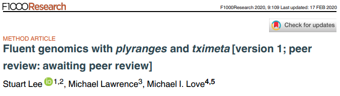
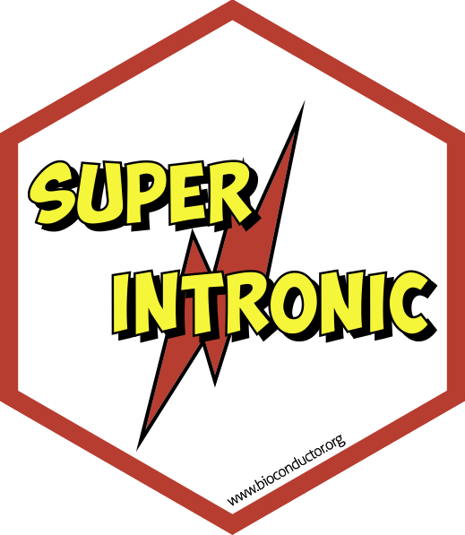
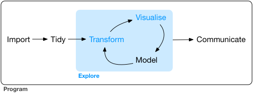
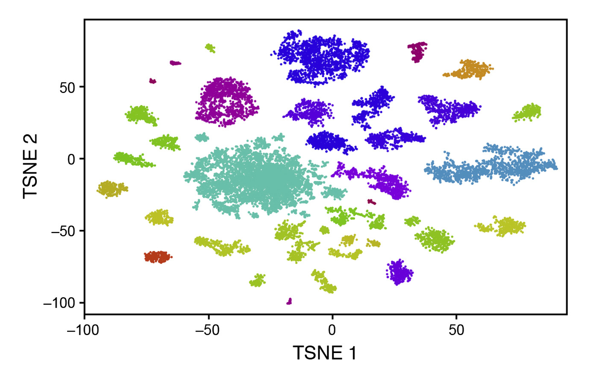
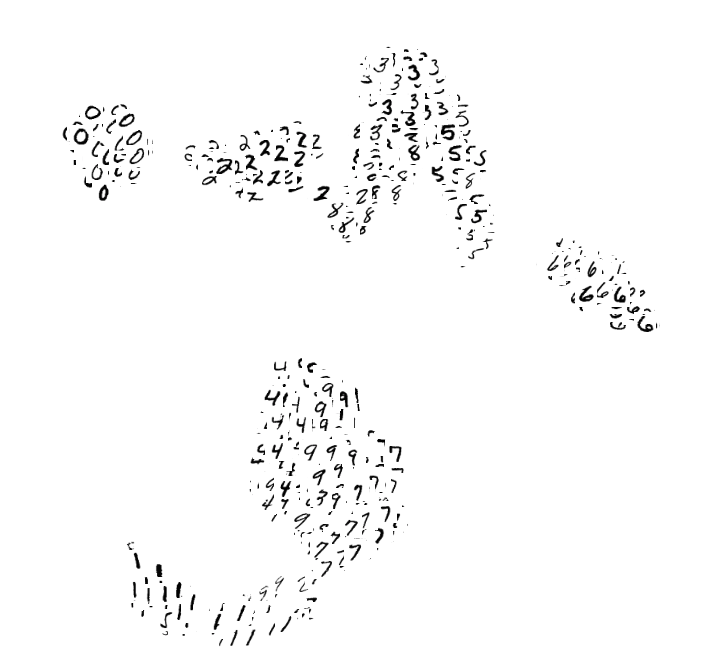
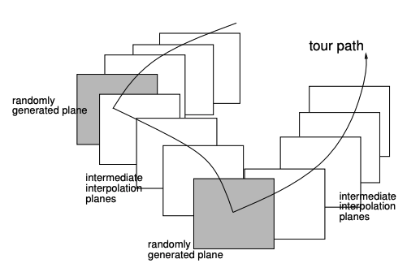
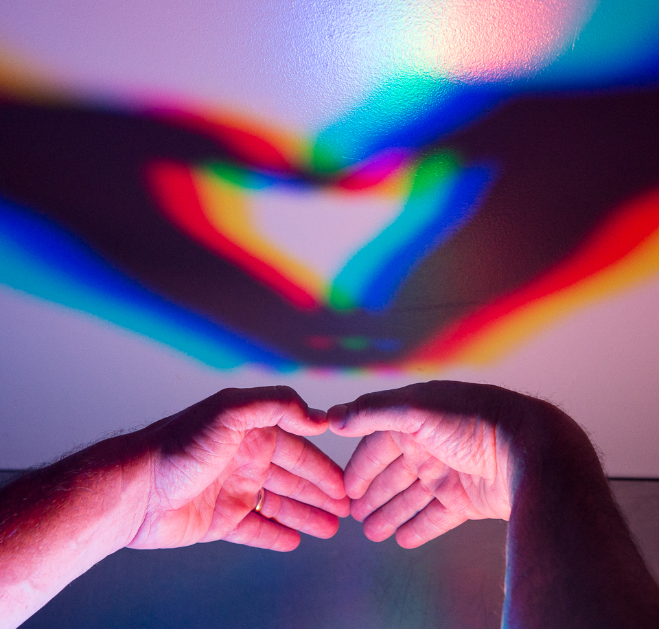
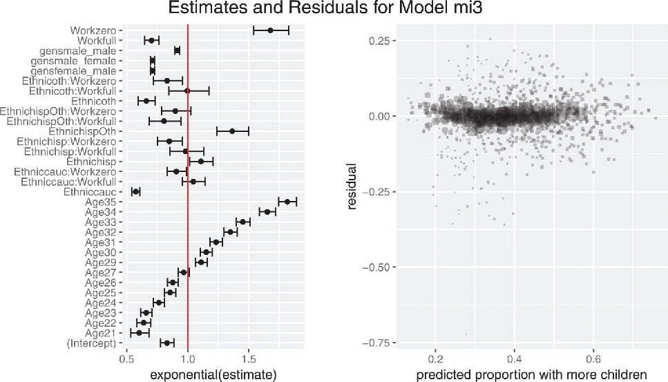
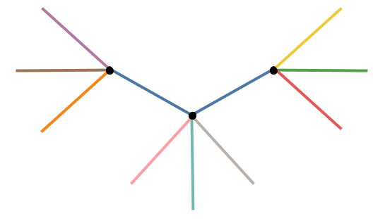

layout: true
<div class="my-footer"><span>bit.ly/39vj1mF • @sa-lee</span></div> 

```{r setup, include=FALSE}
# options(htmltools.dir.version = FALSE, width = 120)
# NOTE TO SELF: The CSS styles were created in `create-sal-theme.R`
knitr::opts_chunk$set(
  fig.path = "img/",
  cache.path = "cache/",
  fig.align = "center",
  fig.width = 13,
  fig.height = 6,
  fig.retina = 3,
  fig.show = "hold",
  external = TRUE,
  # dev = "svglite",
  # dev.args = list(bg = "transparent"),
  message = FALSE,
  warning = FALSE,
  cache = FALSE,
  echo = FALSE,
  autodep = TRUE
)
```

```{r library, include = FALSE}
library(knitr)
library(vegawidget)
library(htmltools)
library(liminal)
```

```{r helpers, include=FALSE}
mp4_vid <- function(src){
  HTML(
    paste0(
      '<video autoplay>
        <source src="', src, '" type="video/mp4">
      </video>'
    )
  )
}

fig.fullsize <- c(fig.height = 3.5, fig.width = 8, out.width = "150%"
)

as_table <- function(...) knitr::kable(..., format='html', digits = 3)
```

---
class: inverse, middle, center

# The story so far...

---
class: center, middle

```{r dse, echo = FALSE, out.width="80%"}
include_graphics("img/data-science.png")
```

---
class: center, middle

```{r dse-human, echo = FALSE, out.width="80%"}
include_graphics("img/data-science-wrangle.png")
```

---
class: center, middle

```{r dse-human-me, echo = FALSE, out.width="80%"}
include_graphics("img/data-science-wrangle.png")
```

.large[
👩🏽
🔬🧬🧬👨🏻
🔬
]
---

```{r plyranges, echo = FALSE, out.width="80%"}

```

```{r plyranges-hex, echo = FALSE, out.width="30%"}

```

---

```{r f1000, echo = FALSE, out.width = "80%"}

```

---

```{r superintronic-paper, out.width = "80%"}

```

```{r superintronic-hex, out.width = "30%"}

```
---
class: middle, center 

```{r back-to-cycle, echo = FALSE, out.width="80%"}
include_graphics("img/data-science-wrangle.png")
```
.large[
👩🏽
🔬🧬🧬👨🏻
🔬
]

---
class: middle, center

```{r me-now, echo = FALSE, out.width="80%"}

```


---
class: middle, center

# high-dimensional interactive data visualisation with tours and embedding

---

# Overview

.large[
* Big Picture
* Orientation: t-distributed stochastic neighbour embedding
* Orientation: tours
* `liminal` package and usage examples
]

---


.pull-left[
```{r, echo= FALSE, fig.show = "hold", fig.align = "center", out.width="100%", out.height="100%"}

```
.small[Retinal cell map from Macosko et al., 2015]
]

.pull-right[
```{r, echo= FALSE, fig.show = "hold", fig.align = "center", out.width="100%", out.height="100%"}

```
.small[Screenshot of Tensorflow Embedding Projector]
]


---

# Big picture: dimensionality reduction

.large[
Let $X$ be an $n \times p$ real data matrix, where $n$ is the number of observations in $p$ dimensions. 

The goal of dimensionality reduction (DR) is to find a low dimensional data representation $Y$, such that $Y$ is an $n \times d$ matrix where $d \ll p$.   
]
---
class: middle

.large[
_Aspiration: the DR procedure  will remove **noise** in the data while revealing **hidden patterns and structure**._
]

---
# DR approaches

.large[_Linear_: $Y$ is a linear transformation of the input $X$, i.e. principal components analysis (PCA).

_Non-linear_: $Y$ is generated via a pre-processed form of the input $X$ such as the $k$-nearest neighbours graph or a kernel transformation. 
]


---
class: middle, center

# How are DR methods used in the wild?

---

# Cluster identification...

```{r cluster-id, echo = FALSE}
# taken from Holmes and Ngyuen
set.seed(98574)
m <- 500
d <- 2
p <- 10
k <- 5
sigma <- 1
muMax <- 25
mu <- matrix(runif(k*d, max = muMax), ncol = d)

X <- lapply(seq_len(k), function(i) {
  ix <- rep(1, m) %*% t(mu[i, ]) + matrix(sigma*rnorm(m*d), ncol = d)
  as.data.frame(ix)
})
X_tbl <- dplyr::bind_rows(X, .id = "cluster")
X <- as.matrix(X_tbl[,-1])
Y <- X  %*% matrix(rnorm(d*p), ncol = p)
pca_y <- prcomp(Y)
X_tbl <- broom::augment(pca_y, X_tbl)
X_tbl <- dplyr::rename_all(X_tbl, 
                          ~stringr::str_replace(., ".fitted", ""))
```

```{r cluster-p, echo = FALSE, dependson=X_tbl, out.width = "80%", out.height="80%"}
library(ggplot2)
p <- ggplot(X_tbl, aes(x = PC1, y = PC2)) + 
  geom_point() + 
  theme_minimal(30) +
  coord_fixed()
p
```

---
# ... and verification


```{r cluster-p2, echo = FALSE, out.width = "80%", out.height="80%"}
p + 
  geom_point(aes(colour = cluster)) +
  scale_color_brewer(palette = "Dark2")
```

---

# Dimension synthesis... 

```{r gp, echo = FALSE}
set.seed(7365) 
n <- 500
p <- 10
sigma <- 0.01
t <- sort(c(seq(0, 1, length.out = 100), runif(n-100)))
K <- exp(-as.matrix(dist(t))) + diag(rep(sigma, n))
Q <- qr.Q(qr(matrix(rnorm(n*n), ncol = n)))
E <- 0.05*matrix(rnorm(n*n), ncol = n)
X <- (K + E) %*% Q[, seq_len(p)]
pca.res <- prcomp(X)
X_tbl <- broom::augment(pca.res)
X_tbl <- dplyr::mutate(X_tbl, depth = t)
X_tbl <- dplyr::rename_all(X_tbl, 
                          ~stringr::str_replace(., ".fitted", ""))
```
```{r, echo = FALSE, out.width = "80%", out.height="80%"}
p <- ggplot(X_tbl, aes(x = PC1, y = PC2)) + 
  geom_point() + 
  theme_minimal(30) +
  coord_fixed()
p
```

---
# ... revealing continuous gradients

```{r gp2, echo = FALSE, out.width = "80%"}
p + 
  geom_point(aes(color = depth)) + 
  scale_color_viridis_c()
```


---
class: inverse, middle

.large[
**Assumption**: 
the DR form is _"faithful"_ to the source high-dimensional data
] 

---

# Orientation with t-SNE

.large[**t-distributed stochastic neighbour embedding**

- extremely popular in bioinformatics and machine learning
- human interpretation can be difficult due to distortions
- highly flexible parameterisations
]

---

.large[
Our high dimensional dataset oriented row wise

$$X = [\mathbf{x_1}, ..., \mathbf{x_n}] \subset \mathbb{R}^p$$ 
and our target lower dimensional embedding  
$$Y =  [\mathbf{y_1}, ..., \mathbf{y_n}] \subset \mathbb{R}^d$$

_for visualisation  $d \in \{1,2,3\}$_.
]
---

# How does the algorithm work?

.large[_Key idea:_ use pairwise $\mathbf{x_i}$ and $\mathbf{x_j}$ 
distances as joint probabilities using a Gaussian kernel

$p_{i|j} = \frac{\exp(-\lVert \mathbf{x_i - x_j} \rVert ^ 2 / 2\sigma_i^2)}{\sum_{k \ne i}\exp(-\lVert \mathbf{x_j - x_k} \rVert ^ 2 / 2\sigma_i^2)}$ and $p_{ij} = \frac{p_{i|j} + p_{j|i}}{2}$
]

---

# How does it work?

.large[The variance $\sigma_{i}^2$ of the Gaussian is chosen based on user supplied value of perplexity:

$\text{perplexity}_i = \exp(-\log(2) \sum_{i \ne j}p_{j|i}\log_2(p_{j|i}))$

_The larger the value of perplexity, the larger the variance.
Perplexity controls the number of nearest neighbours._ 
]

---

# How does it work?

.large[
_Key idea:_ use pairwise distances $\mathbf{y_i}$ and $\mathbf{y_j}$ to form joint probabilities using a Cauchy kernel:

$$q_{ij} = \frac{w_{ij}}{Z}$$ 

where $w_{ij} = \frac{1}{ 1 + \lVert \mathbf{y_i - y_j} \rVert ^ 2}$ and $Z = \sum_{k \ne l} w_{kl}.$
]

---

# How does it work?

.large[
Obtain $Y$ so that Kullback-Leibler divergence between
the probability distributions $\mathcal{P}$ and $\mathcal{Q}$ is minimised:

$$\mathcal{L} = \sum_{i \ne j} p_{ij} \log \frac{p_{ij}}{q_{ij}}$$
]

---

# How does it work?

.large[
The loss function can be recast in terms of .red[attractive] and .blue[repulsive] forces:

$$\mathcal{L} = \color{red}{-\sum_{i \ne j} p_{ij}\log w_{ij}} + \color{blue}{\log\sum_{i \ne j} w_{ij}}$$
]


---

# Important Parameters

.large[
- perplexity 
- early exaggeration 
- step size (learning rate)
- number of iterations
- initialisation of $Y$ (default is random)
]

---
class: inverse, middle, center

# That's a lot! Let's look at pictures!

---

# Continuous gradients revisited

.center[
```{r gradients-revisited, echo = FALSE, out.width="80%"}
p + 
  geom_point(aes(color = depth)) + 
  scale_color_viridis_c()
```
]
---

# Now with more t-SNE

.center[
```{r gradients-revisted-tsne, cache = TRUE, echo = FALSE, out.width = "80%"}
set.seed(1999)
tsne_run <- list(
  default = Rtsne::Rtsne(X, pca = FALSE)$Y,
  perplexity = Rtsne::Rtsne(X, pca = FALSE, perplexity = nrow(X) / 100)$Y,
  learning_rate = Rtsne::Rtsne(X, pca = FALSE, eta = nrow(X) / 12)$Y,
  y_init = Rtsne::Rtsne(X, pca = FALSE, Y_init = clamp_sd(pca.res$x[,1:2], sd = 1e-4))$Y
)
tsne_run <- dplyr::bind_rows(
  lapply(tsne_run, 
         function(.) { 
           cbind(as.data.frame(.), 
                 data.frame(depth = t)) 
         }),
  .id = "type") 
tsne_run[["type"]] <- factor(tsne_run[["type"]],
                             levels = unique(tsne_run[["type"]]),
                             labels = c("default",
                                        "learning rate: 40",
                                        "perplexity: 5",
                                        "PCA initialisation"))
tsne_view <- ggplot(tsne_run, aes(x = V1, y = V2, color = depth)) +
  geom_point() +
  facet_wrap(~type, scales = "free") +
  scale_color_viridis_c() +
  xlab("tsne1") + ylab("tsne2") +
  theme_minimal(30)

tsne_view
```
]
---

# t-SNE gives a lot of flexibility

.large[
- there's a lot of parameters to tweak
- emphasises locality, distance between clusters of points can be misleading
- size of clusters can be misleading 
- may require a few different runs to capture topology of data
- if there are clusters it will find them 
]

---
class: middle, inverse, center


# tSNE is state of the art, but how can we help analysts use it?


---

# Orientation with tours

.large[

- a technique from statistical graphics
- has been successfully applied to problems in particle physics and model interpretation
- can be used to visualise $d \gt 3$ using $d = 1$ or $d=2$ views

]

---


# Description

.large[
Recall our $n \times p$ data matrix $X$

A tour is sequence of $p \times d$ orthonormal projection matrices (bases) $A_{t \in \mathbb{N}}$, where $d$ is typically $1$ or $2$.

A tour allows us to explore the set of all $d$-dimensional subspaces via the projection of $X$ onto $A$. 
]

---

# How does it work?

.large[
We visualise the sequence of low dimensional projections:

$$Y_{t} = XA_{t}$$

as animated scatter or density plots. 
]

---

.large[**Grand Tour:** generate a set of random orthnormal bases, interpolate between them.]

```{r basis-view, out.width="50%", echo = FALSE}

```

(From _Buja, Cook, Asimov and Hurley, 2004_)
---

# We need interactivity

.large[The tour is greatly enhanced by interactivity:

- play/pause the current projection
- zooming to find 'interesting' points
- highlighting sets of points
- linking between multiple views
]

---
class: inverse, middle, center

# A brief software sojourn

---

# `liminal` an R package for interactive tours

.large[
- extends the `tourr` package but uses a modern R API
- leverage client-side visualisation and interaction via `vegawidget`
- treats the basis generation/interpolation steps as a reactive stream  
]

---

# The API and hidden messages

```{r, echo = TRUE, eval = FALSE}
library(liminal)

data(pollen, package = "animation")

limn_tour(
  pollen, 
  cols = dplyr::everything() # which columns to form X,
  tour_path = grand_tour() # how to generate the sequence
)
```


---
class: middle, center
# Demo #1, the secret word is...

---

# Tours as reactive streams

.large[
- don't need to realise the entire sequence
- instead generate new bases according to a fixed frame rate
- allows user interactions to play/pause on the current view
]
---
class: middle, center

# Demo #2, continuous gradients revisited (again)

---

# Thesis Driven Development

.large[
- `liminal` began life as [`sneezy`](https://github.com/sa-lee/sneezy)
- __desire__ to have interactivity built in from the start
- __building__ on top of `vegawidget`
- prototype $\longleftrightarrow$ edge-case $\longleftrightarrow$ re-factor 

]

---

class: inverse, middle, center

# Casting Multiple Shadows

---
class: middle, center

.large[

```{r, echo = FALSE, out.width = "100%"}

```
]

---

# Why settle for 'just' one visualisation?

.medium[

```{r, echo = FALSE, out.width = "50%"}

```
Ensemble Graphics provide new perspectives and connections 
_(Unwin, 2018)_
]

---

# `liminal` an R package for ensembling tours and embeddings

.large[
- **concatenated views:** see local and global structures
- **user interactions:** verify cluster shapes and locations
- **quality checks:** interrogate an embedding with reference
to the underlying data
]


---

# Case study: High-dimensional trees, $p=100$, $n=3000$

.center[
```{r fake-trees, echo = FALSE, out.width = "50%", fig.cap="Example from Kevin Moon"}

```
]


---
class: inverse, middle, center

# Demo 3: linked highlighting shows how default t-SNE breaks topology

---
class: inverse, middle, center

# Demo 4: simple linked brushing identifies distortions


---
class: inverse, middle

.large[
**Assumption**: 
the DR form is _"faithful"_ to the source high-dimensional data
] 


---

class: middle, center

.huge[Or: how do you know if an embedding is 'good'?]


---
class: middle, center

.huge[
**Answer**: It depends.
]

---

# A non-exhaustive list of things you could look at

.medium[
- **distance preservation**: what is the relationship between pairwise distances in $X$ and pairwise distances in $Y$?
- **neighbourhood preservation**:  do points in $Y$ have the same nearest neighbours as those in $X$? And vice-versa?
- **rank preservation**: replace distances with ranks 
]

---
class: middle, center


.huge[Can these be investigated visually?]

---

# Spatial Linked Brushes

.large[
**Key idea:** Look-up the $k$-nearest neighbours graph for observations that fall inside a brushing region for a given view. 
]

---

---
# Spatial Linked Brushes

.large[
**Key idea:** In the secondary view, highlight the corresponding neighbours using colour or transparency. 
]

---
# Spatial Linked Brushes

.large[

**distortion**: points that are far away in one view, will show neighbours that are close together in the opposing view.

**diffusion**: points that are close in one view, will show neighbours that are far apart in the opposing view. 

]

---

# Spatial Linked Brushes

.medium[
- The $k$ nearest neighbours graph can be pre-computed quickly, for either $X$, $Y$ or both.
- Instead of using the neighbour indices, we could use the neighbour distances instead
- Composition of multiple brushes could be used to show where there are matches/mismatches between nearest neighbour graphs 
]


<!-- # Case study: QuickDraw -->

<!-- --- -->

<!-- # Description -->

<!-- --- -->

<!-- # When does a cat look like a dog? -->

<!-- --- -->

---

# Thesis Driven Development Part 2

.large[
- adding interactions increases code complexity
- __latency:__  round-trips between R and Javascript 
- __discoverability:__ specifying UI elements at the code level or within the app?
- __displays:__ appropriate visual encodings for large _n_

]

---

# Next steps

.medium[
- Implementation and testing of spatial brushes
- Cleaner user controls and interface
- Scaling up for larger datasets
- Exploration of other non-linear embedding techniques
- Getting the package on CRAN
]

---

# Take homes

.large[

* DR oriented workflows are complimented by the tour
* Composing multiple views provides more insight 
* User interactions allow us to explore and check *tSNE* views
]

---

# Acknowledgements

.large.pull-left[
- Di Cook
- Matt Ritchie
- Paul Harrison
]

.large.pull-right[
- David Frazier
- Charity Law
- Ursula Laa
- Nick Tierney
- Earo Wang
]

---

# Colophon

.medium[
- Slides made using [xaringan](https://github.com/yihui/xaringan) using [Nick Tierney's template](https://github.com/njtierney/njt-talks)
- Extended with [xaringanthemer](https://github.com/gadenbuie/xaringanthemer)
- Colours taken + modified from [Maureen Stone's Tableau10 Palettes](https://research.tableau.com/user/maureen-stone)
- Header font is **Montserrat**
- Body text font is **Open Sans**
- Code font is **Fira Mono**
]

---

# Learning more

.large[
`r icon::fa_box_open() ` [liminal](https://github.com/sa-lee/liminal)

`r icon::fa('link')` [talk link](https://bit.ly/39vj1mF)
]


---

.vhuge[
**End.**
]
