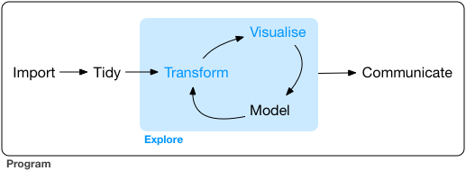

layout: true
<div class="my-footer"><span>bit.ly/LINK • @sa-lee</span></div> 

```{r setup, include=FALSE}
# options(htmltools.dir.version = FALSE, width = 120)
# NOTE TO SELF: The CSS styles were created in `create-sal-theme.R`
knitr::opts_chunk$set(
  fig.path = "img/",
  cache.path = "cache/",
  fig.align = "center",
  fig.width = 13,
  fig.height = 6,
  fig.retina = 3,
  fig.show = "hold",
  external = TRUE,
  # dev = "svglite",
  # dev.args = list(bg = "transparent"),
  message = FALSE,
  warning = FALSE,
  cache = FALSE,
  echo = FALSE,
  autodep = TRUE
)
```

```{r library, include = FALSE}
library(knitr)
library(vegawidget)
library(htmltools)
library(liminal)
```

```{r helpers, include=FALSE}
mp4_vid <- function(src){
  HTML(
    paste0(
      '<video autoplay>
        <source src="', src, '" type="video/mp4">
      </video>'
    )
  )
}

fig.fullsize <- c(fig.height = 3.5, fig.width = 8, out.width = "150%"
)

as_table <- function(...) knitr::kable(..., format='html', digits = 3)

# palette
slpal <- list(red = "#d51d5e",
             orange = "#ffc358",
             blue = "#00CFFF",
             tan = "#D0C1AA",
             light_blue = "#C0DDE1",
             light_tan = "#F2E4DA",
             light_orange = "#fdf4ac",
             light_red = "#D98594",
             pale_blue = "#86C2DA",
             pale_tan = "#fff4dc",
             pale_orange = "#E7C99E",
             pale_red = "#E3A1B8")


```

---
class: inverse, middle, center

# The story so far...

---
class: center, middle

```{r dse, echo = FALSE, out.width="80%"}

```

---
class: center, middle

```{r dse-human, echo = FALSE, out.width="80%"}
include_graphics("img/data-science-explore-human.png")
```

---
class: center, middle

```{r dse-me, echo = FALSE, out.width="80%"}
include_graphics("img/data-science-explore-me.png")
```

---

```{r plyranges, echo = FALSE, out.width="80%"}
include_graphics("img/plyranges-paper.png")
```

```{r plyranges-hex, echo = FALSE, out.width="30%"}
include_graphics("img/plyranges.png")
```

---

```{r f1000, echo = FALSE, out.width = "80%"}

```

---

```{r superintronic-paper, out.width = "80%"}
include_graphics("img/superintronic-paper.png")
```

```{r superintronic-hex, out.width = "30%"}
include_graphics("img/superintronic.png")
```
---
class: inverse, middle, center 

```{r back-to-cycle, echo = FALSE, out.width="80%"}
include_graphics("img/data-science-explore-human.png")
```

---
class: middle, center

```{r me-now, echo = FALSE, out.width="80%"}
include_graphics("img/data-science-explore-human-now.png")
```


---
class: middle, center

# high-dimensional interactive data visualisation with tours and embedding

---

# Overview

* Big Picture
* Orientation: t-distributed stochastic neighbor embedding
* Orientation: tours
* Why interactive graphics are a must
* Our approach `liminal` and implementation details
* Case studies


---

.pull-left[
```{r, echo= FALSE, fig.show = "hold", fig.align = "center", out.width="100%", out.height="100%"}

```
.small[Retinal cell map from Macosko et al., 2015]
]

.pull-right[
```{r, echo= FALSE, fig.show = "hold", fig.align = "center", out.width="100%", out.height="100%"}

```
.small[Screenshot of Tensorflow Embedding Projector]
]


---

# Big picture: dimensionality reduction

.large[
Let $X$ be an $n \times p$ real data matrix, where $n$ is the number of observations in $p$ dimensions. 

The goal of dimensionality reduction (DR) is to find a low dimensional data representation $Y$, such that $Y$ is an $n \times d$ matrix where $d \ll p$.   
]
---
class: middle

.large[
_Aspiration: the DR procedure  will remove **noise** in the data while revealing **hidden patterns and structure**._
]

---
# DR approaches

.large[_Linear_: $Y$ is a linear transformation of the input $X$, i.e. principal components analysis (PCA).

_Non-linear_: $Y$ is generated via a pre-processed form of the input $X$ such as the $k$-nearest neighbours graph or a kernel transformation. 
]


---
class: middle, center

# How are DR methods used in the wild?

---

# Cluster idenfication...

```{r, echo = FALSE}
# taken from Holmes and Ngyuen
set.seed(98574)
m <- 100
d <- 2
p <- 10
k <- 5
sigma <- 1
muMax <- 25
mu <- matrix(runif(k*d, max = muMax), ncol = d)

X <- lapply(seq_len(k), function(i) {
  ix <- rep(1, m) %*% t(mu[i, ]) + matrix(sigma*rnorm(m*d), ncol = d)
  as.data.frame(ix)
})
X_tbl <- dplyr::bind_rows(X, .id = "cluster")
X <- as.matrix(X_tbl[,-1])
Y <- X  %*% matrix(rnorm(d*p), ncol = p)
X_tbl <- broom::augment(prcomp(Y), X_tbl)
X_tbl <- dplyr::rename_all(X_tbl, 
                          ~stringr::str_replace(., ".fitted", ""))
```

```{r, echo = FALSE, dependson=X_tbl, out.width = "80%", out.height="80%"}
library(ggplot2)
p <- ggplot(X_tbl, aes(x = PC1, y = PC2)) + 
  geom_point() + 
  theme_minimal(30) +
  coord_fixed()
p
```

---
# ... and verification


```{r, echo = FALSE, out.width = "80%", out.height="80%"}
p + 
  geom_point(aes(colour = cluster)) +
  scale_color_brewer(palette = "Dark2")
```

---

# Dimension synthesis... 

```{r, echo = FALSE}
set.seed(7365) 
n <- 500
p <- 10
sigma <- 0.01
t <- sort(c(seq(0, 1, length.out = 100), runif(n-100)))
K <- exp(-as.matrix(dist(t))) + diag(rep(sigma, n))
Q <- qr.Q(qr(matrix(rnorm(n*n), ncol = n)))
E <- 0.05*matrix(rnorm(n*n), ncol = n)
X <- (K + E) %*% Q[, seq_len(p)]
pca.res <- prcomp(X)
X_tbl <- broom::augment(pca.res)
X_tbl <- dplyr::mutate(X_tbl, depth = t)
X_tbl <- dplyr::rename_all(X_tbl, 
                          ~stringr::str_replace(., ".fitted", ""))
```
```{r, echo = FALSE, out.width = "80%", out.height="80%"}
p <- ggplot(X_tbl, aes(x = PC1, y = PC2)) + 
  geom_point() + 
  theme_minimal(30) +
  coord_fixed()
p
```

---
# ... revealing continous gradients

```{r, echo = FALSE, out.width = "80%"}
p + 
  geom_point(aes(color = depth)) + 
  scale_color_viridis_c()
```


---
class: inverse, middle

.large[
**Assumption**: 
the DR form is _"faithful"_ to the high-dimensional data it was obtained 
] 

---

# Orientation with t-SNE

.large[**t-distributed stochastic neighbour embedding**

- extremely popular in bioinformatics and machine learning
- human interpretation can be difficult due to distortions
- highly flexible parameterisations
]

---

# Description

Our high dimensional dataset $X = [\mathbf{x_1}, ..., \mathbf{x_n}] \subset \mathbb{R}^p$ and our target lower dimensional embedding  $Y =  [\mathbf{y_1}, ..., \mathbf{y_n}] \subset \mathbb{R}^d$

_for visualisation generally $d =  2$ or $d = 3$
---

# How does it work?

.large[Key idea: model pairwise high-dimensional distances as joint probabilities using a Gaussian kernel

$p_{i|j} = \frac{\exp(-\lVert \mathbf{x_i - x_j} \rVert ^ 2 / 2\sigma_i^2)}{\sum_{k \ne i}\exp(-\lVert \mathbf{x_j - x_k} \rVert ^ 2 / 2\sigma_i^2)}$ and $p_{ij} = \frac{p_{i|j} + p_{j|i}}{2}$
]

---

# How does it work?

.large[The variance $\sigma_{i}^2$ is chosen based on user supplied
value of perplexity:

$\text{perplexity}_i = \exp(-\log(2) \sum_{i \ne j}p_{j|i}\log_2(p_{j|i}))$

_The larger the value of perplexity, the larger the variance.
Perpelxity controls the number of nearest neighbors._ 
]

---

# How does it work?

.large[
Key idea: model pairwise distances in the embedding space $Y$ as joint probabilities using a Cauchy kernel:

$$q_{ij} = \frac{w_{ij}}{Z}$$ 

where $w_{ij} = \frac{1}{ 1 + \lVert \mathbf{y_i - y_j} \rVert ^ 2}$ and $Z = \sum_{k \ne l} w_{kl}.$
]

---

# How does it work?

.large[
Obtain $Y$ that minimises the Kullback-Leibler divergence between
the probability distrubtions:

$$\sum_{i \ne j} p_{ij} \log \frac{p_{ij}}{q_{ij}}$$
]

---

# How does it work?

.large[
The loss function can be recast in terms of .red[attractive] and .blue[repulsive] forces:

$$\color{red}{-\sum_{i \ne j} p_{ij}\log w_{ij}} + \color{blue}{\log\sum_{i \ne j} w_{ij}}$$
]


---

# Important Parameters

.large[
- perplexity 
- early exaggeration (adds a multiplier to the attractive force)
- step size (learning rate)
- number of iterations
- initialisation of $Y$
]

---
class: inverse, middle, center

# That's a lot! Let's look at pictures!

---

# Continuous gradients 

```{r}
set.seed(1999)
default <- Rtsne::Rtsne(X)$Y
perp5 <- Rtsne::Rtsne(X, perplexity = nrow(X) / 100)$Y
eta <- Rtsne::Rtsne(X, eta = nrow(X) / 12)$Y
y_init <- Rtsne::Rtsne(X, Y_init = )
```

----

# Orientation with tours

---


# Description

---

# How does it work?

---


# Why do we need interactivity?

---

# Tours as streams

---

# How does this work?

---

# Hidden messages

```{r, echo = TRUE, eval = FALSE}
library(liminal)
data(pollen, package = "animation")
limn_tour(pollen, cols = dplyr::everything())
```

---

# Hidden messages

```{r, eval = FALSE}
# show output as video
mp4_vid
```

---

# Our approach: you can have it all

---

# Ensemble graphics

---

# Interactions

---

# Linked Brushing and Highlighting

---

# How do they work?

---

# Case study: High-dimensional trees

---

# Description

---

# Linked highlighting shows how t-SNE breaks topology

---

# Reparmeterising partially fixes the problem

---

# Linked Brushing identifies distortions

---

# Case study: QuickDraw

---

# Description

---

# When does a cat look like a dog?

---

# Limitations

---

# Spatially resolved brushes

---

# How do they work?

---

# Future Directions

.large[
- More features
- More features
- More features
]

---

# Take homes

---


# Acknowledgements

.large.pull-left[
- Di Cook
- Matt Ritchie
- Paul Harrison
]

.large.pull-right[
- Ursula Laa
- Nick Tierney
]

---

# Colophon

.large[
- Slides made using [xaringan](https://github.com/yihui/xaringan)
- Extended with [xaringanthemer](https://github.com/gadenbuie/xaringanthemer)
- Colours taken + modified from [Kiki's Delivery Service](https://github.com/ewenme/ghibli)
- Header font is **Montserrat**
- Body text font is **Open Sans**
- Code font is **Fira Mono**
]

---

# Learning more

.large[
`r icon::fa_box_open() ` [liminal](https://github.com/sa-lee/liminal)

`r icon::fa('link')` [talk link]()
]


---

.vhuge[
**End.**
]
