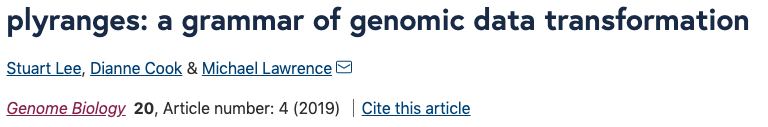
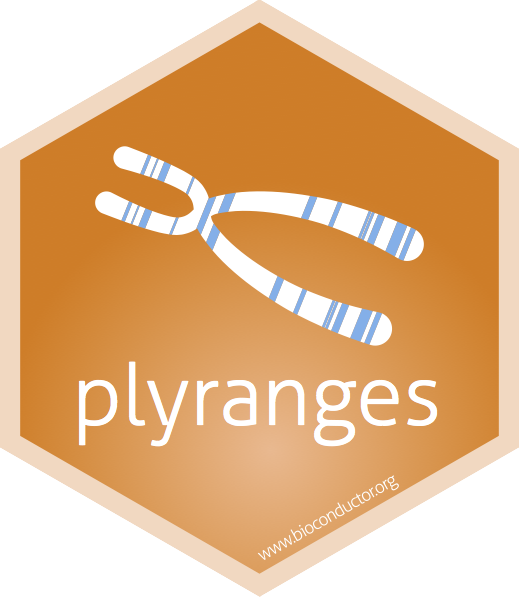

layout: true
<div class="my-footer"><span>bit.ly/LINK • @sa-lee</span></div> 

```{r setup, include=FALSE}
# options(htmltools.dir.version = FALSE, width = 120)
# NOTE TO SELF: The CSS styles were created in `create-sal-theme.R`
knitr::opts_chunk$set(
  fig.path = "img/",
  cache.path = "cache/",
  fig.align = "center",
  fig.width = 13,
  fig.height = 6,
  fig.retina = 3,
  fig.show = "hold",
  external = TRUE,
  # dev = "svglite",
  # dev.args = list(bg = "transparent"),
  message = FALSE,
  warning = FALSE,
  cache = FALSE,
  echo = FALSE,
  autodep = TRUE
)
```

```{r library, include = FALSE}
library(knitr)
library(vegawidget)
library(htmltools)
library(liminal)
```

```{r helpers, include=FALSE}
mp4_vid <- function(src){
  HTML(
    paste0(
      '<video autoplay>
        <source src="', src, '" type="video/mp4">
      </video>'
    )
  )
}

fig.fullsize <- c(fig.height = 3.5, fig.width = 8, out.width = "150%"
)

as_table <- function(...) knitr::kable(..., format='html', digits = 3)

# palette
slpal <- list(red = "#d51d5e",
             orange = "#ffc358",
             blue = "#00CFFF",
             tan = "#D0C1AA",
             light_blue = "#C0DDE1",
             light_tan = "#F2E4DA",
             light_orange = "#fdf4ac",
             light_red = "#D98594",
             pale_blue = "#86C2DA",
             pale_tan = "#fff4dc",
             pale_orange = "#E7C99E",
             pale_red = "#E3A1B8")

```

---
class: inverse, middle, center

# The story so far...

---
class: center, middle

```{r dse, echo = FALSE, out.width="80%"}
include_graphics("img/data-science-explore.png")
```

---
class: center, middle

```{r dse-human, echo = FALSE, out.width="80%"}

```

---
class: center, middle

```{r dse-me, echo = FALSE, out.width="80%"}

```

---

```{r plyranges, echo = FALSE, out.width="80%"}

```

```{r plyranges-hex, echo = FALSE, out.width="30%"}

```

---

```{r f1000, echo = FALSE, out.width = "80%"}
include_graphics("img/f1000.png")
```

---

```{r superintronic-paper, out.width = "80%"}
include_graphics("img/superintronic-paper.png")
```

```{r superintronic-hex, out.width = "30%"}

```
---
class: inverse, middle, center 

```{r back-to-cycle, echo = FALSE, out.width="80%"}

```

---
class: middle, center

```{r me-now, echo = FALSE, out.width="80%"}

```

---
class: middle, center

# Interactive visualisation for high-dimensional data analysis

---

# Motivation: non-linear dimensionality reduction methods

---

# Big picture: what do these methods do?

---

# Big picture: How are these methods used in the wild?

---
# Cluster orientation tasks

---

# Cluster idenfication, shapes, and verification

---

# Two approaches embeddings and tours

---

# Orientation with t-SNE

---

# Description

---

# How does it work?

---

# Important parameters

---

# t-SNE views

state of the art, mental map in high-dimensional plot
hold on to these ideas 

----

# Orientation with tours

---


# Description

---

# How does it work?

---


# Why do we need interactivity?

---

# Tours as streams

---

# How does this work?

---

# Hidden messages

```{r, echo = TRUE, eval = FALSE}
library(liminal)
data(pollen, package = "animation")
limn_tour(pollen, cols = dplyr::everything())
```

---

# Hidden messages

```{r, eval = FALSE}
# show output as video
mp4_vid
```

---

# Our approach: you can have it all

---

# Ensemble graphics

---

# Interactions

---

# Linked Brushing and Highlighting

---

# How do they work?

---

# Case study: High-dimensional trees

---

# Description

---

# Linked highlighting shows how t-SNE breaks topology

---

# Reparmeterising partially fixes the problem

---

# Linked Brushing identifies distortions

---

# Case study: QuickDraw

---

# Description

---

# When does a cat look like a dog?

---

# Limitations

---

# Spatially resolved brushes

---

# How do they work?

---

# Future Directions

.large[
- More features
- More features
- More features
]

---

# Take homes

---


# Acknowledgements

.large.pull-left[
- Di Cook
- Matt Ritchie
- Paul Harrison
]

.large.pull-right[
- Ursula Laa
- Nick Tierney
]

---

# Colophon

.large[
- Slides made using [xaringan](https://github.com/yihui/xaringan)
- Extended with [xaringanthemer](https://github.com/gadenbuie/xaringanthemer)
- Colours taken + modified from [Kiki's Delivery Service](https://github.com/ewenme/ghibli)
- Header font is **Montserrat**
- Body text font is **Open Sans**
- Code font is **Fira Mono**
]

---

# Learning more

.large[
`r icon::fa_box_open() ` [liminal](https://github.com/sa-lee/liminal)

`r icon::fa('link')` [talk link]()
]


---

.vhuge[
**End.**
]
